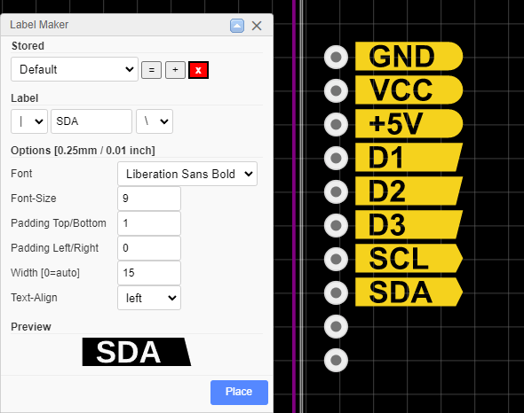

EasyEDA Label Maker
===================

## Installation
1) Download the [latest extension.zip from releases](https://github.com/xsrf/easyeda-labelmaker/releases) and extract the files to your harddisk (temporary)
1) Open [EasyEDA](https://easyeda.com/editor) in Browser or Desktop
1) In EasyEDA go to "Advanced" > "Extensions" > "Extensions Settings ..." > "Load Extension..." > "Select Files ..."
1) Select all files from the "extension" directory of your extracted download and hit "Load Extension"
1) You're done, close the dialog (you can delete the files from your harddisk)

## How to use it
After install, a "Label Maker" menu should show up in the PCB editor. Click "Create Label". After setting your options, hit "Place" or press "enter" to place the label on the board. After the label is placed, the input text is focused again. Just hit "enter" again to place the same label or type anything to change the label text.

Labels are placed to the currently active pcb layer.

### Options
All measurements in the options are about 0.01 inch or 0.25 mm. I fugured any conversion it is not necessary here because exact measurments are usually not required for labels and you better go by "the looks" of it. Also the actual font family used may affect measurments slightly.

### Font
You can choose any font that is ailable in EasyEDA except the default ones of EasyEDA (for some reason these are not shipped by EasyEDA but used via API calls). Since you may not have additional fonts installed, this extension comes with one so you have at least one to select from.
You can install additional fonts (ttf, otf or woff) via EasyEDAs *Fonts Manager*. You may have to hit "Rebuild Fonts Cache" after you installed a new font.

*Tipp:* On Windows, drag'n'drop fonts from the system fonts directory to a regular directory to get access to the ttf files. You can access the fonts directory by running (Win+R) "shell:fonts".

### Font size
The font size is approximately the height of the character "X" in your font. You can use decimal numbers.

### Padding
The padding is added around the bounding box of your text (with ascedants/descendants like "y" and "Ö" ignored). You can use decimal numbers or even negative numbers.

### Width and Text-Align
Usually the width of the label is determined by the width of the text in it.
If you want labels of a fixed with, so they lign up nicely, use *width* together with the *Text-Align* feature.

### Easy label placing
The extension is optimized for a fast workflow. After placing, the input is selected again. You can just go "GND" *enter* - *click* to place - "VCC" *enter* - *click* to place - "+5V" *enter* - *click* to place etc...

### Alignment
Labels can be aligend, mirrored, distributed using the built in functions of EasyEDA

## Limitations
The labels are generated and placed as SVG graphics. Editing the labels properties afterwards is not possible.

So far I've also not found a way to set the reference point for placing the label.

## Libraries used
The generator uses [opentype.js](https://opentype.js.org/) (which is also used by EasyEDA itself) and [paper.js](http://paperjs.org/).

*opentype.js* can create text as SVG paths from any given ttf, otf or woff font.
*paper.js* is used to create the surrounding shape of the label and to combine (subtract) the text and the shape. paper.js is really good at cleaning up the SVG path which would show lots of artefacts otherwise.

## Inspiration
The Extension is inspired by the [SparkFun Buzzard Label Generator](https://github.com/sparkfunX/Buzzard) and I blame [@arturo182](https://twitter.com/arturo182/status/1348415792254169089) and [@GregDavill](https://twitter.com/GregDavill/status/1348957557503578113) for getting me started on this ❤
